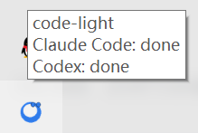
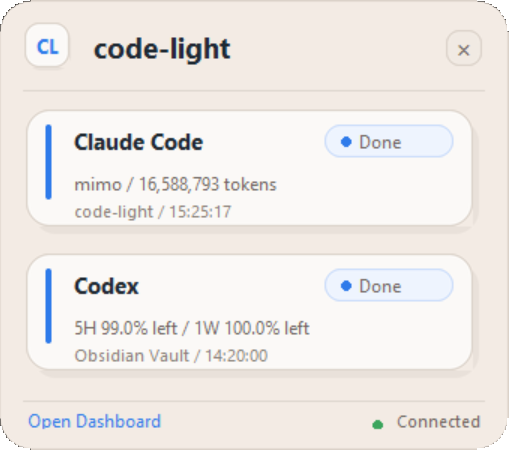
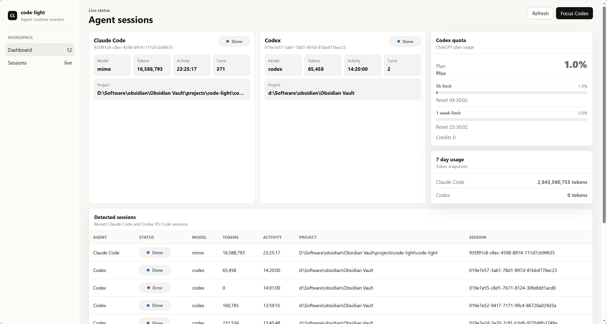

# ⚡ code-light

English | [中文](README.zh-CN.md)

Lightweight desktop status monitoring for AI coding workflows.

code-light monitors Codex and Claude Code status via VS Code extensions, displays real-time status in the system tray and desktop floating window, tracks token usage and package quotas, and enables one-click jumps to VS Code windows.

## Features

- 🖥️ **System Tray Icon** - Dynamic status indicator with color-coded states
- 🪟 **Floating Window** - Always-on-top desktop widget with live status
- 📊 **Web Dashboard** - Detailed usage statistics and history
- 🤖 **Claude Code Monitoring** - Track DeepSeek/Mimo API token usage
- 💻 **Codex Monitoring** - Track OpenAI package quota
- 🚀 **One-Click Jump** - Instantly focus VS Code windows
- 🔔 **Quota Warnings** - Get notified before hitting limits

## Screenshots

### System Tray



### Desktop Widget



### Web Dashboard



## Installation

### Prerequisites

- Windows 10/11
- Python 3.11+
- [uv](https://github.com/astral-sh/uv) package manager

### Install with uv

```bash
# Clone the repository
git clone https://github.com/Bayern4ever-dot/code-light.git
cd code-light

# Install dependencies
uv sync

# Run
uv run code-light
```

### Install as package

```bash
# Install from source
uv pip install -e .

# Run
code-light
```

## Usage

### Basic Usage

```bash
# Start with default settings
code-light

# Start with debug logging
code-light --debug

# Start with floating window hidden
code-light --no-floating

# Custom dashboard port
code-light --port 8080

# Custom poll interval (seconds)
code-light --poll-interval 60

# Custom floating window opacity
code-light --opacity 0.9
```

### System Tray

- **Left-click**: Open dashboard
- **Right-click**: Context menu with options
- **Status colors**:
  - 🟢 Green: Working
  - 🟡 Yellow: Waiting for input
  - 🟠 Orange: Quota warning
  - 🔴 Red: Error
  - ⚫ Gray: Idle/Offline

### Floating Window

- **Drag**: Move window
- **Double-click title**: Open dashboard
- **Click agent card**: Focus VS Code window
- **✕ button**: Hide window

### Dashboard

Access at `http://127.0.0.1:7681` (default port).

Features:
- Real-time status monitoring
- Token usage statistics (7-day, 30-day)
- Task history
- Cost tracking
- One-click VS Code focus

## Architecture

```
code-light/
├── src/code_light/
│   ├── __main__.py          # Entry point
│   ├── app.py               # Application orchestrator
│   ├── config.py            # Configuration (immutable dataclass)
│   ├── state.py             # SQLite state persistence
│   ├── models.py            # Data models
│   ├── monitors/
│   │   ├── claude_code.py   # Claude Code session monitor
│   │   ├── codex.py         # Codex quota monitor
│   │   └── process.py       # VS Code process detector
│   ├── services/
│   │   ├── quota.py         # Quota tracking & warnings
│   │   ├── token_counter.py # Token counting & cost
│   │   └── vscode.py        # VS Code window management
│   └── ui/
│       ├── tray.py          # System tray (pystray)
│       ├── floating.py      # Floating window (tkinter)
│       └── dashboard.py     # Web dashboard (Flask)
└── dashboard/
    ├── templates/           # Jinja2 templates
    └── static/              # CSS, JS, icons
```

## Data Sources

### Claude Code

- Session files: `~/.claude/projects/**/*.jsonl`
- Parses JSONL for token usage, model, timestamps
- Tracks DeepSeek/Mimo API token consumption

### Codex

- Auth file: `~/.codex/auth.json`
- Usage API: `chatgpt.com/backend-api/wham/usage`
- Rate limit tracking (primary/secondary windows)
- Credits balance monitoring

### VS Code

- Window detection via Win32 API
- Process enumeration with psutil
- Window title parsing for project/agent info

## Development

### Setup

```bash
# Clone
git clone https://github.com/Bayern4ever-dot/code-light.git
cd code-light

# Install dev dependencies
uv sync --dev

# Run tests
uv run pytest

# Run linter
uv run ruff check .

# Run type checker
uv run mypy src/
```

### Project Structure

- `src/code_light/`: Main package
- `dashboard/`: Web dashboard frontend
- `tests/`: Test suite

## License

MIT License

## Acknowledgments

- [claudebar](https://github.com/mryll/claudebar) - Claude subscription monitoring for Waybar
- [codexbar](https://github.com/mryll/codexbar) - Codex subscription monitoring for Waybar
- [TokenTracker](https://github.com/mm7894215/TokenTracker) - Multi-tool token tracking
